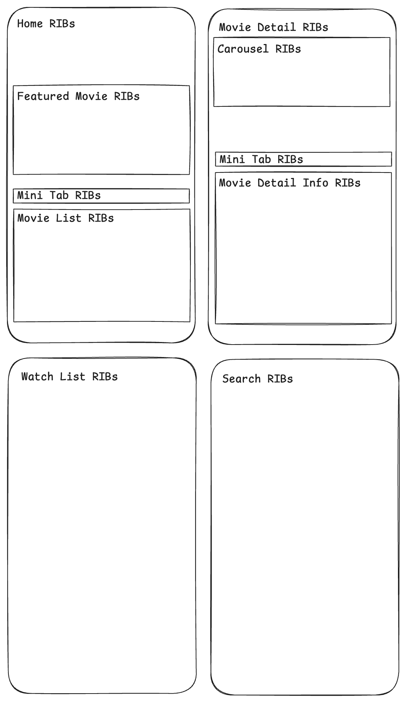

# 🎬 TMDB-RIBs-iOS

[](https://swift.org)
[](https://developer.apple.com/ios/)
[](https://github.com/uber/RIBs)

A modular iOS application powered by **RIBs** architecture, consuming [The Movie Database (TMDB)](https://www.themoviedb.org/documentation/api) API to showcase movie data — such as now playing, popular, top-rated, and more. This project demonstrates scalable, reactive, and maintainable iOS app architecture.

| Below iOS 26 | iOS 26 |
|------------|----------------|
|||

---

## ✨ Features

### 🎥 Core
- Browse **Now Playing**, **Up Coming**, **Popular**, and **Top Rated** movies  
- **Movie Detail View** — overview, release info, rating, genres  
- **Search** movies by title with live updates 
- **Watch List** movies by clicked save button
- **Infinite Scroll & Pagination** support  
- **Error / Empty / Loading** state handling  

### 🧩 Architecture & Tech
- **RIBs (Router-Interactor-Builder)** modular architecture  
- **RxSwift** for reactive data flow  
- **Moya** for TMDB API integration  
- **SnapKit** for programmatic Auto Layout  
- **Kingfisher** for efficient image caching  
- **Clean navigation** and dependency injection per feature  

---

## 🧱 Architecture Overview

RIBs separates business logic, navigation, and view rendering into distinct units.

```
Root RIB
 ├── Home RIB (handle scrolling and pagination/load more)
 │      ├── Featured RIB (Trending movies by today)
 │      └── Movie List RIB (Now Playing, Up Coming, Top Rated, Popular)
 ├── Search RIB (browse, search)
 ├── Watch List RIB (saved movies)
 └── Movie Detail RIB (backdrop, poster and movie info)
     └── Movie Detail Info RIB (overview, reviews, actors & crew)
```

| Component | Responsibility |
|------------|----------------|
| **Router** | Handles navigation and view hierarchy |
| **Interactor** | Core business logic, handles user actions |
| **Builder** | Assembles RIB components with dependencies |
| **Presenter / ViewController** | Displays data & binds to Interactor |

---

## ⚙️ Tech Stack

| Library / Framework | Purpose |
|----------------------|----------|
| [RIBs](https://github.com/uber/RIBs) | Modular architecture framework |
| [RxSwift](https://github.com/ReactiveX/RxSwift) | Reactive programming |
| [Moya](https://github.com/Moya/Moya) | API networking abstraction |
| [Kingfisher](https://github.com/onevcat/Kingfisher) | Image loading & caching |
| [SnapKit](https://github.com/SnapKit/SnapKit) | Programmatic Auto Layout |
| UIKit | View rendering |
| Swift Package Manager | Dependency management |

---

## 🚀 Getting Started

### Prerequisites
- Xcode 15 or later  
- iOS 15.0+ target  
- Swift 5.9+  
- TMDB API key ([get one here](https://www.themoviedb.org/settings/api))

### Installation

1. Clone this repository:

   ```bash
   git clone https://github.com/alifu/TMDB-RIBs-iOS.git
   cd TMDB-RIBs-iOS
   ```

2. Configure your **API key**  
   Duplicate `.env.example` file and rename to `.env` or using this command in terminal:

   ```bash
   $ cp .env.example .env
   ```

   Then set all variable base on your account [from here](https://www.themoviedb.org/settings/api).

3. Open the project:

   ```bash
   open TMDB-RIBs-iOS.xcodeproj
   ```

4. Build & run the app:

   - Select a simulator or device  
   - Press **⌘ + R**

Swift Package Manager will automatically fetch dependencies on first build.

---

## 📂 Project Structure

```
TMDB-RIBs-iOS/
├── Module/
│   ├── Root/
│   ├── FeaturedMovie/
│   ├── MainTabbar/
│   ├── MovieDetail/
│   ├── MovieDetailInfo/
│   ├── MovieList/
│   ├── Search/
│   └── WatchList/
├── Data/               # Model and APIManager
│   └── Model/          # Data models (Movie, Genre, etc.)
├── Networking/         # TMDB API layer
├── ReusableView/       # Custom UI components
├── Extension/          # UIKit / RxSwift extensions
├── Utils/              # Color, fonts, etc.
└── App/                # AppDelegate, SceneDelegate, etc.
```

Each module is an isolated RIB to ensure independence and reusability.

---

## 🔌 API Integration

Using [The Movie Database API](https://developer.themoviedb.org/reference), common endpoints include:

| Endpoint | Description |
|-----------|--------------|
| `/trending/movie/day` | Today trending movies |
| `/movie/now_playing` | Now playing movies |
| `/movie/popular` | Popular movies |
| `/movie/top_rated` | Top-rated movies |
| `/movie/upcoming` | Top-rated movies |
| `/movie/{id}` | Movie details |
| `/movie/{id}/credits` | Cast & crew |
| `/movie/{id}/review` | Movie reviews |
| `/search/movie` | Search for movies |
| `/movie/{id}/account_states` | Movie status that connected to account |
| `/account/{accountID}/watchlist/movies` | Watch List movies |

Networking is handled through Moya for cleaner endpoint definitions and response mapping.

---

## 🧪 Roadmap

| Status | Feature |
|:------:|----------|
| ✅ | Movie discovery (now playing, popular, top-rated, etc) |
| ✅ | Movie search |
| ✅ | Movie details (overview, rating, release year) |
| ✅ | Modular navigation using RIBs |
| ✅ | Cast and video sections |
| ✅ | Caching support for images |
| 🚧 | Offline cache support for APIs |
| 🚧 | Trailer |
| 🚧 | Unit & UI tests |
| 🚧 | SwiftUI hybrid example |

#### Design Canvas



---

## 🧠 Learning Objectives

This project aims to demonstrate:

- Clean modular architecture using **RIBs**
- Reactive UI updates with **RxSwift**
- Clear API abstraction using **Moya**
- UI layout with **SnapKit**
- Maintainable module boundaries for large-scale iOS apps
- Implementation of **Liquid Glass effect (iOS 26+)** within `UITabBarController`

### 💧 Liquid Glass Tab Bar (iOS 26+)

Starting from iOS 26, UIKit introduces support for **glass-like translucency** using the new `UIBlurEffect` and `UITabBarAppearance` APIs.  
This project includes an example of how to:

- Enable **Liquid Glass / Transparent Material** effect in the `UITabBarController`
- Support **vibrancy and layered blur** under iOS 26 and newer
- Maintain fallback appearance for earlier iOS versions (≤ iOS 18)
- Integrate the effect cleanly into a modular RIBs-based UI flow

The goal is to show how modern UI effects can coexist with a scalable architecture.

---

## 🪪 License

This project is licensed under the [MIT License](LICENSE).

---

## 🙏 Acknowledgments

- [The Movie Database (TMDB)](https://www.themoviedb.org/) for providing open movie data  
- [Uber’s RIBs](https://github.com/uber/RIBs) for modular architecture inspiration  
- [Figma Community](https://www.figma.com/design/cnbqNR95PxjrZPvZ75GaAB/Movies-app--Community-?node-id=6-686&p=f&t=4f4B033MmOqKNu8d-0) for the beautiful design inspiration
- Open source libraries that make this possible ❤️

---

> _Built with passion for clean architecture and movies._ 🎬  
> — [@alifu](https://github.com/alifu)
